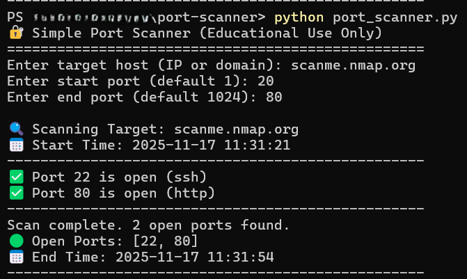

# 🔍 Port Scanner (Cybersecurity Tool)


---

## 🧩 Description

A lightweight Python-based **Port Scanner** designed to identify open ports on a target host for educational and defensive cybersecurity purposes.  
Developed by **Edward Hudson Jr.**

---

## :gear: Features

- Scan a target host for open ports.
- Supports specifying a custom port range.
- Easy-to-read console output.
- Educational tool for ethical cybersecurity learning.

---

## 🛠️ Setup Instructions

1. **Clone the repository**

```bash
git clone https://github.com/ehudson92/port-scanner.git
cd port-scanner
```

2.Ensure Python 3.12+ is installed

```bash
python --version 
```

3.Install dependencies (This is a very basic version, no external dependencies are required :)

```bash
pip install -r requirements.txt
```

---

## :rocket: Usage

Run the port scanner via the terminal:

```bash
python port_scanner.py 
```

Follow the prompts:

1. Enter the target IP or hostname.
2. Specify a port range (or leave default).
3. Review the list of open ports detected

## :test_tube: :scroll: Example Screenshot

| Target Host | Port | Screenshot Results |
|----------|--------------|-------------|
| scanme.nmap.org | Start Port: 20 End Port: 80 |  |

## :balance_scale: Ethical Disclaimer

This tool is **Strictly for educational,testing, and defensive purposes**. Unauthorized scanning of networks without explicit permission is illegal and unethical. By using this tool, you agree to use it responsibly and in compliance with all applicable laws.

## :bust_in_silhouette: Author

Edward Hudson Jr.

- LinkedIn <https://www.linkedin.com/in/edwardhudsonjrofficial>

- GitHub <https://github.com/ehudson92>
